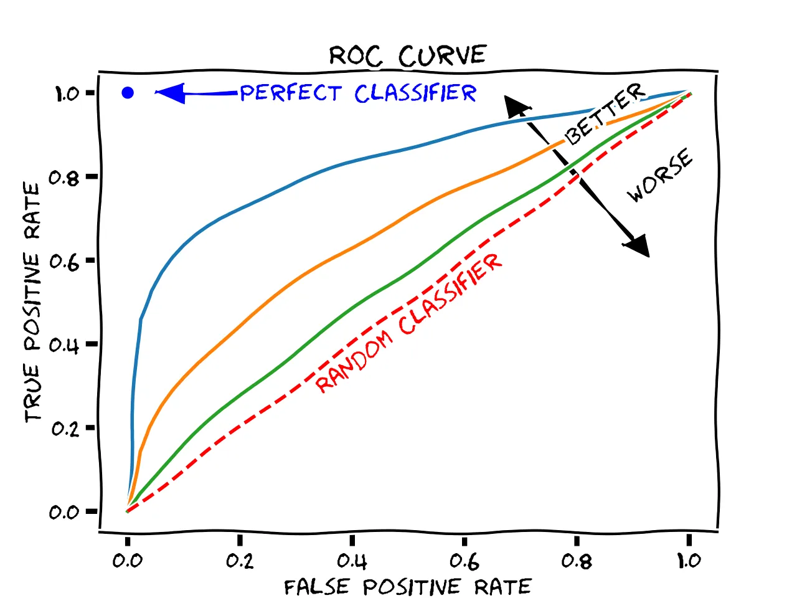
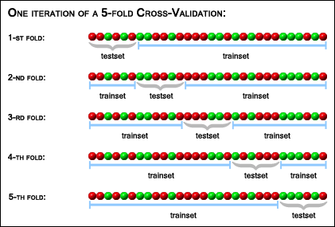
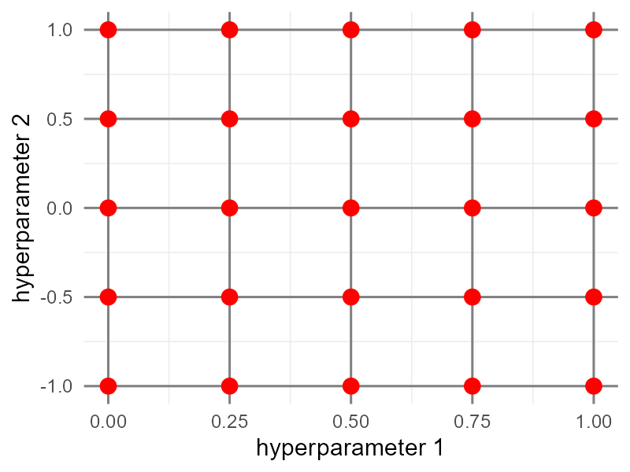
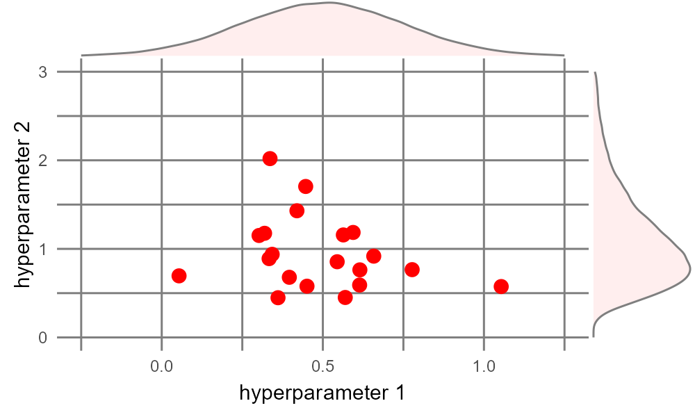
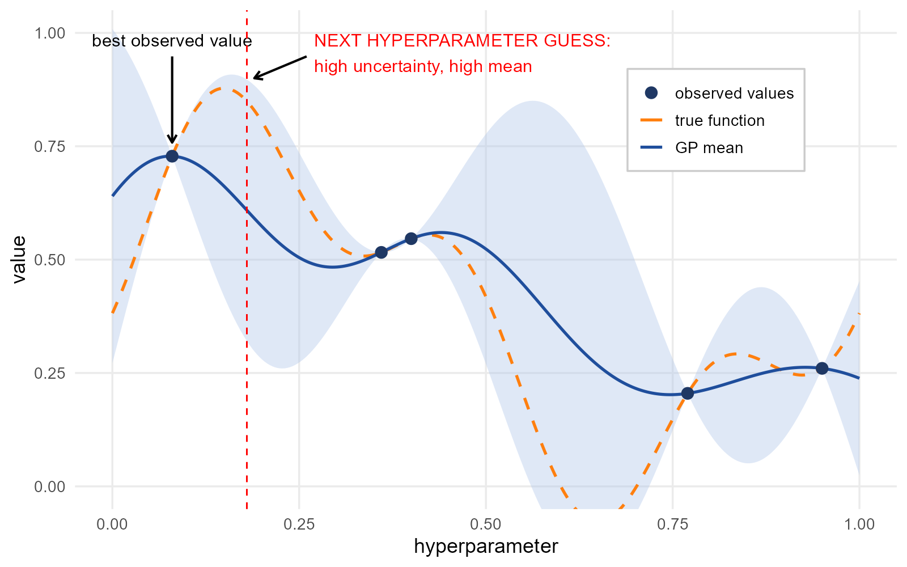

<!--
Prerequisite lessons: 
* tidy data
* 
-->

:::{.callout-learning}
After completing this session, you will be able to:

* Explain the purpose of partitioning data into training, validation/assessment, and test sets, and describe why this practice helps prevent overfitting
* Apply `rsample::initial_split()` and `rsample::`vfold_cv()` to partition and resample a dataset
* Construct classification models using `parsnip`, applying a consistent syntax across multiple algorithms
* Evaluate model performance using appropriate classification metrics
* Compare multiple model specifications and algorithms using cross-validated performance metrics to select a best-performing model.
* Distinguish between model parameters and hyperparameters, and describe at a conceptual level how tuning strategies search hyperparameter space
:::

## Overview

- Overview
  - overview of objectives - classification and regression without using those terms

BUILD THIS OUT

<!-- ## Data for Exercises -->

<!-- LAND COVER DATA FOR CLASSIFICATION https://archive.ics.uci.edu/static/public/31/covertype.zip citation: Blackard, J. (1998). Covertype [Dataset]. UCI Machine Learning Repository. https://doi.org/10.24432/C50K5N. -->

<!-- :::{.callout-note collapse=true} -->
<!-- ### About the data -->

<!-- https://archive.ics.uci.edu/dataset/31/covertype -->

<!-- Predicting forest cover type from cartographic variables only (no remotely sensed data).  The actual forest cover type for a given observation (30 x 30 meter cell) was determined from US Forest Service (USFS) Region 2 Resource Information System (RIS) data.  Independent variables were derived from data originally obtained from US Geological Survey (USGS) and USFS data.  Data is in raw form (not scaled) and contains binary (0 or 1) columns of data for qualitative independent variables (wilderness areas and soil types). -->

<!-- This study area includes four wilderness areas located in the Roosevelt National Forest of northern Colorado.  These areas represent forests with minimal human-caused disturbances, so that existing forest cover types are more a result of ecological processes rather than forest management practices. -->
<!-- ::: -->


## Machine Learning Overview

[Full Screen](slides/r_machine_learning_tidymodels/slides1_machine_learning.html)

```{=html}
<iframe class="slide-deck" src="slides/r_machine_learning_tidymodels/slides1_machine_learning.html" style="border: 1px solid #2e3846;"></iframe>
```

:::callout-tip
### An Entertaining Reference

https://vas3k.com/blog/machine_learning/ - This entertaining and informative high-level overview of machine learning, in a similar vein to [XKCD](https://xkcd.com/) or [Wait but Why](https://waitbutwhy.com/), provides conceptual descriptions of how various ML algorithms work and concrete real-world examples of how you might encounter them in the wild.
:::

## Setup

### Intro to tidymodels and components

BUILD THIS OUT

- load packages
- load data
- data overview

```{r}
#| warning: false
#| message: false
library(dplyr)

### a metapackage like tidyverse, tidymodels contains many model-relevant 
### packages incl rsample, parsnip, recipes, yardstick, broom - we don't 
### need to worry about the differences here...
library(tidymodels) 
library(palmerpenguins)

penguins_clean <- penguins %>%
  drop_na() %>%
  ### convert characters to factors - easier for modeling engines!
  mutate(species = factor(species), sex = factor(sex), island = factor(island))

penguins_clean$species %>% table()
penguins_clean$sex %>% table()
```

## Data Partitioning

One characteristic of machine learning is dividing data into several discrete, non-overlapping bundles, so we can train our algorithms on one set and then test it against another set.  These slides give an overview of why this is important and what the overall machine learning process looks like.

[Full Screen](slides/r_machine_learning_tidymodels/slides2_partitioning.html)

```{=html}
<iframe class="slide-deck" src="slides/r_machine_learning_tidymodels/slides2_partitioning.html" style="border: 1px solid #2e3846;"></iframe>
```

### Manual Partitioning

For conceptual understanding, let's see one way of manually partitioning our data, by randomly assigning observations to each of Training, Validation, and Testing partitions with approximate proportions of 70/15/15:

* Create a vector with bins allocated in our desired proportions
* Randomly assign samples from that vector to each of our observations
* Create separate data frames by filtering on those bins.

```{r}
bins <- c(rep('training', 70), rep('validation', 15), rep('testing', 15))

set.seed(123) ### so we all get the same results each time
part_df <- penguins_clean %>%
  mutate(partition = sample(bins, replace = TRUE, size = n()))
# table(part_df$partition) / nrow(part_df)
#    testing   training validation 
#  0.1681682  0.6786787  0.1531532
train_df <- part_df %>% filter(partition == 'training')
valid_df <- part_df %>% filter(partition == 'validation')
test_df  <- part_df %>% filter(partition == 'testing')
```

:::callout-note
#### Stratified Partitioning

Often our data is unbalanced, meaning certain values of our outcome variable show up far more frequently than others - for example, rare species will show up far less frequently in a field study than common species.  In such cases, it is a good practice to do "stratified partitioning" to ensure that the proportions of outcome categories within each partition are similar to the proportions in the overall dataset.  

It is also sometimes useful to stratify on predictors, to maintain class balance for critical subgroups.  In our `penguins` dataset, there are more than twice as many Adelies as Chinstraps, while male and female are approximately equally represented.

Stratified partitioning would make our manual code more complicated, but it is very easy to do in `tidymodels`.
:::

### Partitioning With `rsample::initial_split`

Partition the penguins data, with 85% going into our training set (which we will resample later as 70%-15%), and 15% set aside for final testing.  Our outcome variable, `sex`, is already pretty balanced, so instead we will stratify on the `species` column (`strata = species`), so each species will have the same proportional representation in our training and test sets!
    
```{r}
set.seed(42)
peng_split <- initial_split(penguins_clean, prop = 0.85, strata = species)
peng_train_df <- training(peng_split)
peng_test_df  <- testing(peng_split)
# table(peng_test_df$species) / nrow(peng_test_df); table(peng_train_df$species) / nrow(peng_train_df)
# #    Adelie Chinstrap    Gentoo;      Adelie Chinstrap    Gentoo
# # 0.4313725 0.2156863 0.3529412;   0.4397163 0.2021277 0.3581560

# table(peng_test_df$sex) / nrow(peng_test_df); table(peng_train_df$sex) / nrow(peng_train_df)
# #    female      male;      female      male
# # 0.6078431 0.3921569;   0.4751773 0.5248227 
```

:::callout-tip
### When should we worry about imbalanced data?

Generally we only really need to be concerned when one class (e.g., one species or sex) only makes up ~10% or less of a dataset.  For small datasets, imbalance can be very problematic - if one of our species had only 5% of observations, the model would only have 16-17 penguins to learn its patterns!
:::

Let's further partition our _training_ split into _analysis_ and _assessment_ sets.  To get the 85% separated into 70% and 15% accordingly, we can just use proportions.  Let's stratify on `sex` again!
```{r}
peng_train_split <- initial_split(peng_train_df, prop = 70/85, strata = sex)
peng_analysis <- training(peng_train_split)
peng_assess   <- testing(peng_train_split)
```

Our data now looks like:

```{mermaid}
%%| fig-align: center
flowchart LR
  A[(penguins_clean)] --> B[/peng_train_df/]
  A --> C[/peng_test_df/]
  B --> D[Resample]
  D --> D1[/peng_analysis/]
  D --> D2[/peng_assess/]
```

## Setting Up A Model

Hundreds of modeling algorithms are available across many different R packages; while they share similarities, they also include idiosyncratic object formats and methods.  The `parsnip` package within `tidymodels` provides access to modeling algorithms while enforcing a consistent syntax.

For our classification task, let's start with a logistic regression model; various packages and functions provide logistic regression, but we'll stick with the basic one from the `stats::glm` function.

* Define the model type (and "engine" i.e., the source of the algorithm, if desired)
* Specify a model with dependent and independent variables, and use `parsnip::fit()` to train the data

```{r}
blr_mdl <- parsnip::logistic_reg() %>%
  parsnip::set_engine('glm') ### this is the default - we could try engines from other packages or functions

peng_fit1 <- blr_mdl %>%
  ### Specify a model with all biometric predictor variables
  parsnip::fit(sex ~ species + bill_length_mm + bill_depth_mm + flipper_length_mm + body_mass_g, 
               data = peng_analysis)

peng_fit2 <- blr_mdl %>%
  ### Specify a model with a sub set of biometric predictor variables
  fit(sex ~ species + bill_length_mm + bill_depth_mm, 
      data = peng_analysis)

### let's also create a model we know will be bad:
peng_fit3 <- blr_mdl %>%
  ### Specify a model with predictors that are likely low value
  fit(sex ~ species + island + year, data = peng_analysis)

# broom::tidy(peng_fit1)
# broom::tidy(peng_fit2)
# broom::tidy(peng_fit3)
```

### Assessing Model Performance

Now we can use our models to predict classifications in our `peng_assess_df` and judge the prediction quality in several ways. For a classification task, we look at how well it discriminates between our two classes.  Let's check our first model and our garbage model.

```{r}
peng_pred1 <- peng_assess %>%
  mutate(predict(peng_fit1, new_data = ., type = 'class'))
peng_pred3 <- peng_assess %>%
  mutate(predict(peng_fit3, new_data = ., type = 'class'))
```

:::callout-important
#### "Positive" vs. "Negative" for Classification Tasks

In basic classification, we are discriminating between two potential values of a categorical variable.  These two values are typically generalized as Positive vs. Negative.  These are often arbitrary but knowing which is which is critical to understanding your outcomes.  Examples:

* Medical Diagnosis: Positive = Has Disease / Negative = Healthy
* Spam Detection: Positive = Spam / Negative = Normal Email
* Fraud Detection: Positive = Fraud / Negative = Legit Transaction.

In our case, because we treat `sex` as a factor and `female` is alphabetically before `male`, R by default will treat `female` as Negative and `male` as Positive.  We could force this the other way (e.g., setting factor levels), but it will not affect our overall outcomes.

:::

:::panel-tabset
#### Confusion Matrix

For classification problems, a "confusion matrix" shows True Positives and Negatives vs. False Positives and Negatives. True female (`sex`) vs. predicted female (`.pred_class`) = True Negative; true male/predicted female = False Negative; male/male = True Positive; female/male = False Positive.

```{r}
peng_pred1 %>% select(sex, .pred_class) %>% table()
peng_pred3 %>% select(sex, .pred_class) %>% table()
```

`peng_pred1` has a good True Positive Rate and True Negative Rate; `peng_pred3` has very high False Positive and False Negative Rates.

#### Accuracy

For classification problems, "accuracy" is just the proportion of correct predictions, without worrying about which direction those predictions went (True Positive or True Negative).
```{r}
yardstick::accuracy(peng_pred1, truth = sex, estimate = .pred_class)
yardstick::accuracy(peng_pred3, truth = sex, estimate = .pred_class)
```

#### ROC Curve and AUC

A Receiver Operating Characteristic (ROC) curve plots the tradeoff between the True Positive Rate and False Positive Rate as we change the probability threshold for classifying something as class 1 (vs. class 0) - in our case, classifying a penguin as male.

{fig-width="70%" fig-align="center" .lightbox}

A low threshold means that, even at very low predicted probabilities, we assign "Male" - which means we get most of the males (high True Positive Rate), but we also assign many (true) females to be (false) males (high False Positive Rate).  A high threshold means we need a high predicted probability to classify a penguin as male - meaning we err on the side of classifying as female, i.e., a high True Negative Rate - and misclassify many males as females (high False Negative Rate).

Often we don't even look at the curve, but instead just the area under the curve (AUC) - the ROC curve of a great model will approach the top left of the plot, while a bad model will be close to the diagonal.

To calculate ROC AUC (and the ROC curve) we need not just the predicted classes, but the *probabilities* associated with the predictions.

```{r}
peng_prob1 <- peng_assess %>%
  mutate(predict(peng_fit1, new_data = ., type = 'prob'))
yardstick::roc_auc(peng_prob1, truth = sex, .pred_female, event_level = 'first') # <1>
yardstick::roc_auc(peng_prob1, truth = sex, .pred_male, event_level = 'second') # <2>

peng_prob3 <- peng_assess %>%
  mutate(predict(peng_fit3, new_data = ., type = 'prob'))
yardstick::roc_auc(peng_prob3, truth = sex, .pred_female, event_level = 'first')
```
1. Here, `event_level` defines whether we're looking for the first or second class (female/male in our case), and the `.pred_XXX` should match the event level.
2. Here we swap for `event_level = 'second'` and look to `.pred_male` for our probabilities. 

We can also plot the ROC Curve!

```{r}
roc1_df <- yardstick::roc_curve(peng_prob1, truth = sex, .pred_female)
roc3_df <- yardstick::roc_curve(peng_prob3, truth = sex, .pred_female)

ggplot(data = roc1_df, aes(x = 1 - specificity, y = sensitivity)) +
  geom_abline(intercept = 0, slope = 1, color = 'black') +
  geom_path(color = 'red') +
  geom_path(data = roc3_df, color = 'blue')
```
:::

## Resampling and Cross Validation

With resampling, we do multiple rounds of partitioning with our training data - iteratively resampling _analysis_ and _assessment_ partitions.  Cross validation (CV) is a specific type of resampling - we create multiple equal-sized partitions, called _folds_, and then set aside one fold as _assessment_ and the remaining folds as _analysis_ to train our data, then use the second fold as _assessment_ etc.  If we split our data into five _folds_ we get "five-fold cross validation" - the generic term is K-fold cross validation.  

{fig-width="70%" fig-align="center" .lightbox}

:::callout-tip
### How Many Folds?

Five- and ten-fold CV are basically industry standard - balancing computational effort with accurate performance evaluation, but more art than science. More folds --> less bias, but higher computational cost.  Another method, generally only used for small data sets, is _n_-fold where each observation is its own fold ($k = N$, also called "Leave-One-Out Cross Validation" (LOOCV) since each iteration _leaves out_ one observation as the _assessment_ set).
:::

:::callout-tip
### Repeated Cross-Validation

Often, after completing one set of cross-validation, we shuffle the observations into a new set of folds and do it all again, iterating many times - "repeated k-fold cross validation".  Repeated CV helps improve consistency of our evaluation metrics -- a single round of CV might be prone to an exceptionally lucky (or unlucky) resample, so multiple repeats will help balance that out.

How many repeats?  Like folds, choosing a number is more art than science - but ten is a good starting point, and if the model is pretty unstable (high variance from repeat to repeat) 50-100 repeats is not uncommon.
:::

### Metrics for Assessment

<details on metrics - e.g., RMSE for regression, accuracy for classification>

### Cross Validation: Manual Version

For conceptual understanding, five-fold cross validation on our training set `peng_train_df` might look like this:

* Randomly assign each observation to a fold
* Set fold 1 aside as _assessment_, and folds 2-5 as _analysis_
    * Train the desired model on _analysis_
    * Use trained model to predict on _assessment_
    * Calculate some metric of predictive power, e.g., accuracy for classification or RMSE for regression
    * Store the metric in a vector
* Repeat for the remaining folds

```{r}
fold_vec <- rep(1:5, length.out = nrow(peng_train_df))
peng_folds_df <- peng_train_df %>%
  mutate(fold = sample(fold_vec, replace = FALSE, size = n()))
  
blm1_results_vec <- rep(NA, 5)

for(i in 1:5) {
  assess_df <- peng_folds_df %>% filter(fold == i)
  analysis_df <- peng_folds_df %>% filter(fold != i)
  
  blm1 <- glm(family = 'binomial', 
              sex ~ species + bill_length_mm + bill_depth_mm, 
              data = analysis_df)
  pred_blm1 <- assess_df %>%
    mutate(prob = predict(blm1, newdata = ., type = 'response'), # <1>
           pred_sex = ifelse(prob > 0.5, 'male', 'female'))

  acc_blm1 <- sum(pred_blm1$sex == pred_blm1$pred_sex) / nrow(pred_blm1)
  
  blm1_results_vec[i] <- acc_blm1
}
mean(blm1_results_vec) ### mean accuracy of our given model
```
1. NOTE: `predict()` acts differently here than it did earlier, because we are giving it an object of class `c('glm', 'lm')` - instead of a `tidymodels` friendly class.

### Cross Validation with `tidymodels`

Functions from the `tidymodels` packages automate a lot of that for us.  Additionally, we can create a "workflow" that is easy to read and easy to modify/update with new models or even new algorithms.

Resample the data into five folds (`v = 5`) in a single line - and optionally lets us also do *repeated* rounds of cross validation (`repeats` argument) at the same time!  Here we only do 3 repeats to keep our examples from being too slow, but 10 would be a better choice.

```{r}
peng_train_folds <- vfold_cv(peng_train_df, v = 5, repeats = 3) # <1>
```
1. Usually "k-fold cross validation" but `tidymodels` calls it "v-fold"...?

Now let's create a `workflow` (from the `workflows` package in `tidymodels`) that combines our model and a formula.  We already specified a binary logistic regression model above but we repeat that here for clarity.  The workflow specifies how R will operate across all the folds.
```{r}
blr_mdl <- logistic_reg() %>%
  set_engine('glm')

blr_wf <- workflows::workflow() %>%   ### initialize workflow
  workflows::add_model(blr_mdl) %>%
  workflows::add_formula(sex ~ species + bill_length_mm + bill_depth_mm)
```

OK now let's apply the workflow to our folded training dataset (using the `fit_resamples` function from the `tune` package in `tidymodels`), and see how it performs!  Note `tune::collect_metrics()` automatically reports several relevant metrics for the type of model (classification vs. regression).

```{r}
blr_fit_folds <- blr_wf %>%
  tune::fit_resamples(peng_train_folds)

### Report out the predictive performance across the five folds:
tune::collect_metrics(blr_fit_folds)
```

## Model Selection

Our goal with machine learning is to find a model that best predicts our outcome of interest.  Typically we have more than one candidate model to consider, including variations on predictors and/or entirely different algorithms.  For each candidate model, we can apply the previous steps.  Here, we will try several different algorithms and model specifications.

* Model specifications
    * `sex ~ species + bill_length_mm + bill_depth_mm` (previous step)
    * `sex ~ species + bill_length_mm + bill_depth_mm + flipper_length_mm + body_mass_g` (all biometrics)
    * `sex ~ species + island + year` (garbage model, for comparison)
* Algorithms
    * Binomial logistic regression (previous model)
    * Random Forest classifier: ensemble of small decision trees
    * Support Vector Machine classifier: finds best boundary that separates different groups
    
### Define Model Specifications

We can create formula objects easily, and give them a short name for easy reference.  This is handy to apply a model specification across multiple algorithms.  The formula we would normally insert into the model function, we can just assign to a named object.  R will not attempt to apply the formula until we call it within the model function.

```{r}
spec1 <- sex ~ species + bill_length_mm + bill_depth_mm
spec2 <- sex ~ species + bill_length_mm + bill_depth_mm + flipper_length_mm + body_mass_g
spec3 <- sex ~ species + island + year
```

### Define Model Architecture

Using `tidymodels` (specifically `parsnip` package) we can define the model architectures separately from the model specifications.  Similar to the model specifications, this is handy to apply different algorithms easily.  NOTE: you may need to install the `ranger` and `kernlab` packages - the model engines are not included in `tidymodels`.

```{r}
blr_mdl <- parsnip::logistic_reg() %>% # <1>
  parsnip::set_engine('glm')

rf_mdl <- parsnip::rand_forest(trees = 1000) %>%
  parsnip::set_engine('ranger') %>%     # <2> 
  parsnip::set_mode('classification')   # <3> 
  
svm_mdl <- parsnip::svm_linear() %>%
  parsnip::set_engine('kernlab') %>%    # <4> 
  parsnip::set_mode('classification')   # <5> 
```
1. We already defined `blr_mdl` above, repeating here for clarity
2. `'ranger'` is the default engine for RF, so technically we don't need to specify here, but if we wanted to use a different computational engine (e.g., `'randomForest'`), we could put that here.
3. Random Forest can be used for classification OR regression; here need to specify which approach we want!
4. The default for `svm_linear` is `LiblineaR` but it doesn't work well with character variables, so here we'll specify an alternative computational engine from the `kernlab` package.
5. Similar to random forest, support vector machines can be used for classification OR regression, so we need to specify which.

:::callout-tip
### Computational Engines

Most model algorithms are available from different computational engines, e.g., for logistic regression we could use the `glm()` implementation, or `glmnet`, `LiblineaR`, `stan`, etc.  To see the available engines for an algorithm, use `show_engines()` with the name of the algorithm function in `parsnip`, e.g., `show_engines('logistic_reg')` or `show_engines('rand_forest')`.
:::

### Compare Models

Having defined the model specifications and architectures, let's create workflows, apply them to our `peng_train_folds` set, and see the results.  Note how little we have to change to test a completely different model!  
  
:::panel-tabset
#### Logistic Regression

Here, the workflows are explicitly spelled out one at a time.  In the other tabs, we show options for programmatic iteration!
```{r}
blr_spec1 <- workflow() %>%
  add_model(blr_mdl) %>%
  add_formula(spec1) %>%
  fit_resamples(peng_train_folds)

blr_spec2 <- workflow() %>%
  add_model(blr_mdl) %>%
  add_formula(spec2) %>%
  fit_resamples(peng_train_folds)

blr_spec3 <- workflow() %>%
  add_model(blr_mdl) %>%
  add_formula(spec3) %>%
  fit_resamples(peng_train_folds)

collect_metrics(blr_spec1, type = 'wide')
collect_metrics(blr_spec2, type = 'wide')
collect_metrics(blr_spec3, type = 'wide')
```

#### Random Forest

Iterate over the specifications using a `for` loop, printing out the metrics at the end of each iteration.

```{r}
spec_list <- list(spec1, spec2, spec3)

for(spec in spec_list) {
  rf_specs <- workflow() %>%
    add_model(rf_mdl) %>%
    add_formula(spec) %>%
    fit_resamples(peng_train_folds)
  
  results <- collect_metrics(rf_specs, type = 'wide')
  print(results)
}
```

#### Support Vector Machines

Iterate over the specifications using `purrr::map`, collecting the metrics across the specs as a list of dataframes, which we then bind together into a single dataframe. 

```{r}
spec_list <- list(spec1, spec2, spec3)

svm_specs <- purrr::map(
  .x = spec_list,
  .f = function(spec) {
    mdl <- workflow() %>%
      add_model(svm_mdl) %>%
      add_formula(spec) %>%
      fit_resamples(peng_train_folds)
    
    collect_metrics(mdl, type = 'wide')
  })

svm_specs_df <- svm_specs %>%
  setNames(as.character(spec_list)) %>%
  bind_rows(.id = 'model_spec')

svm_specs_df
```

:::

### Results

Across all algorithms, specification 2 (using all available biometric predictors) moderately outperformed specification 1 (with fewer biometric predictors), and specification 3 (with no biometrics) was generally as bad as just random guessing.

Across the algorithms, SVM > Logistic Regression > Random Forest.

Based on these performance evaluation metrics, our final model would use specification 2 with a support vector machine algorithm.

## Finalizing the Model

At this point, we have partitioned our data using cross validation to identify the best model.  Now, we can put in *all* the training data into our selected model to finalize our model parameters, weights, and coefficients, then compare to the test data we set aside at the very beginning.  The function `parsnip::last_fit()` does all this for us, when we pass it our `peng_split` object that contains both the `peng_train_df` and `peng_test_df`.

```{r}
### set up our final model as a workflow
final_workflow <- workflow() %>%
  add_model(svm_mdl) %>%
  add_formula(spec2)    ### specification with all biometric variables

final_fit <- last_fit(final_workflow, peng_split)

collect_metrics(final_fit)
```


## Optional: Model Tuning

So far we have split our data, used cross validation to identify the best model algorithm and specification, then applied that to our full training data.  The `tidymodels` model functions (`logistic_reg`, `random_forest`, `svm_linear`, etc.) each have several _hyperparameters_, configuration settings that affect how the model learns from the data.  Out of the box, `tidymodels` assigns sensible values for those hyperparameters, but in some cases, those default values can be tweaked to improve the machine learning performance - particularly to avoid overfitting and underfitting.  Model parameters (such as model coefficients and weights) are learned from the data, but _hyperparameters_ control the learning process itself.

Random Forest, for example, has parameters that control the number of decision trees, the number of random features (variables) considered at each node split, tree depth, etc.  Support Vector Machines are configured with parameters for kernel (the mathematical function to transform data into higher-dimensional space - linear, polynomial, distance-based methods), and  regularization parameter C and gamma parameter $\gamma$ to trade off between smoother vs. more tightly curving decision boundaries.  Other algorithms, including logistic regression, might have hyperparameters to apply penalties or costs to large coefficients or large feature sets.

### Common Model Tuning Algorithms

::: panel-tabset

#### Grid Search

A grid search tuning algorithm assigns a vector of values to test for each hyperparameter.  Across multiple hyperparameters, this creates a multi-dimensional grid or array of possible combinations.  Grid search checks every single combination to look for the optimal set.  As such, it is intuitive and thorough, but computationally expensive - a brute force approach.

{fig-align="center"}


#### Randomized Search

A randomized search tuning algorithm randomly samples many potential combinations of hyperparameters.  The values to test for each hyperparameter are drawn from some distribution provided by the user.  Unlike grid search, this tuning algorithm concentrates its efforts on regions of each hyperparameter that are most likely according to the given probability distributions, and is generally able to find a good combination faster than a complete grid search.  In the example image, test values for hyperparameter 1 are chosen assuming a normal distribution, while values for hyperparameter 2 are chosen from a skewed distribution.

{fig-align="center"}


#### Bayesian Optimization

Bayesian optimization tuning algorithm iteratively builds a probabilistic map across hyperparameter space, using a Gaussian process (GP) to approximate the true objective function we want to maximize.  To identify likely values to sample, the algorithm focuses on areas of the parameter space with high information value.  This balances "exploration" (areas of high uncertainty) against "exploitation" (areas of high expected value).  As each point is tested, that information is fed back to the probabilistic model of parameter space, and the next point is chosen to once again maximize the expected information value.  

In the example shown (for a single hyperparameter, for simplicity), the black points have already been tested - so uncertainty collapses to zero.  A value of ~0.18 falls in a region of high uncertainty (wide confidence interval) and likely high value (GP mean is high).  After sampling this point, the confidence intervals and GP mean function will shift accordingly, and the iteration will continue until some stop rule is reached.

{fig-align="center"}

::: 

### Tuning Model Hyperparameters

Each model type has a different set of hyperparameters with different default values and ranges, which can be found by querying the model function help page (for our purposes, `?svm_linear` reveals two parameters, `cost` and `margin`).  

To prepare for tuning, we redefine our model and set the model's parameters to a placeholder function `tune()` to flag it for optimization.  Then let's rebuild our model specification using `spec1` from above (the one with all the biometric variables) using the same workflow from before.  We will also reuse our folds defined above - `peng_train_folds` defined with `vfold_cv()` - for cross validation during the tuning process.

```r
mdl_tune <- svm_linear(cost = tune(), margin = tune()) %>%
  set_engine('kernlab') %>%
  set_mode('classification')

wf_tune <- workflow() %>%
  add_model(mdl_tune) %>%
  add_formula(spec1)
```

Let's try Bayesian optimization!  (A grid search is already outlined in the [`tidymodels` documentation](https://www.tidymodels.org/start/tuning/#tuning)).  

We provide our model specification and our resamples to the `tune_bayes()` function to identify the best values for our parameters.  From these results, we select the best parameter set using the cleverly named function `select_best()`.

```r
bayes_results <- tune_bayes(
  object = wf_tune,
  resamples = peng_train_folds
)

best_params <- select_best(bayes_results, metric = 'roc_auc')
```

We can insert these best hyperparameter values back into our workflow, and then perform our final fit just as we did above.

```r
final_tuned_wf <- finalize_workflow(wf_tune, best_params)

final_tuned_fit <- last_fit(final_tuned_wf, peng_split)
```


## Optional: Model Interpretation
   


